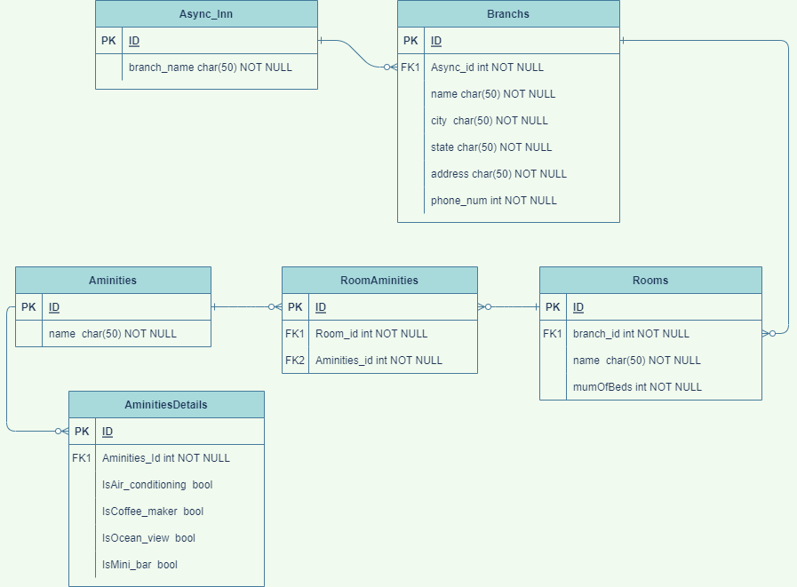

# Lab11-Relational-Databases

* **Async Inn**
* **Mutaz Altbakhi**
* **14/4/2022**



```
AN Async Inn hotel has many branchs,  but a Branch can belong only one to the Async Inn Hotel.

Each branch has many Rooms, but a Room can belong to only one branch.

Each Room has many RoomsAmenities and each RoomsAmenities have one Room.

Each amenities has many RoomsAmenities and each RoomsAmenities have one amenities.

Each amenities has many AminitiesDetails but a RoomsAmenities can belong to only one amenities.

RoomAmenities table is composite table and have two composite keys.
```


*  Async_Inn table hase one to many relationship with Branchs table
* Branchs table has one to many relationship with Rooms table
* Rooms table has many to many relashionship with Aminities table so i did Composite table
    - Rooms has one to many relationship with composite table RoomAminities
    - Aminities has one to many relationship with composite table RoomAminities
* Aminities has one to many relationship with AminitiesDetails table 